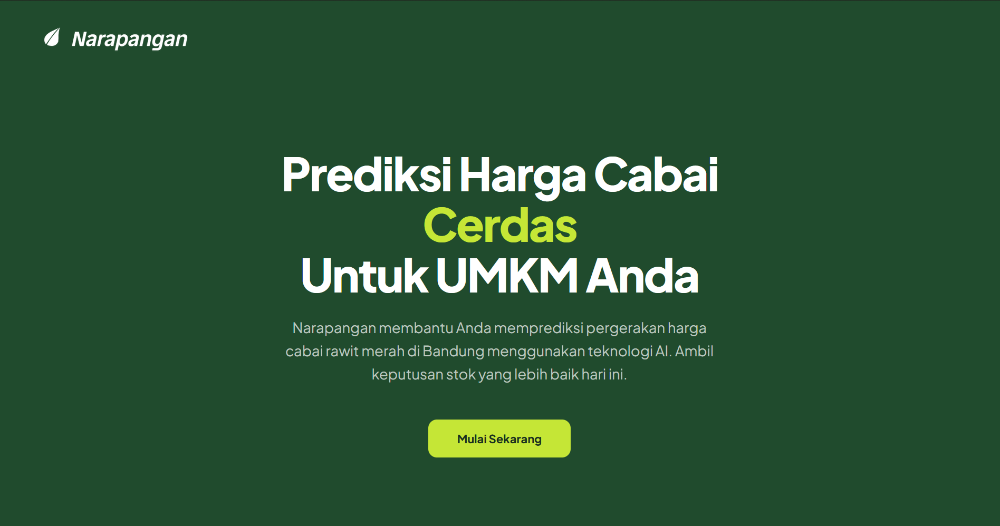
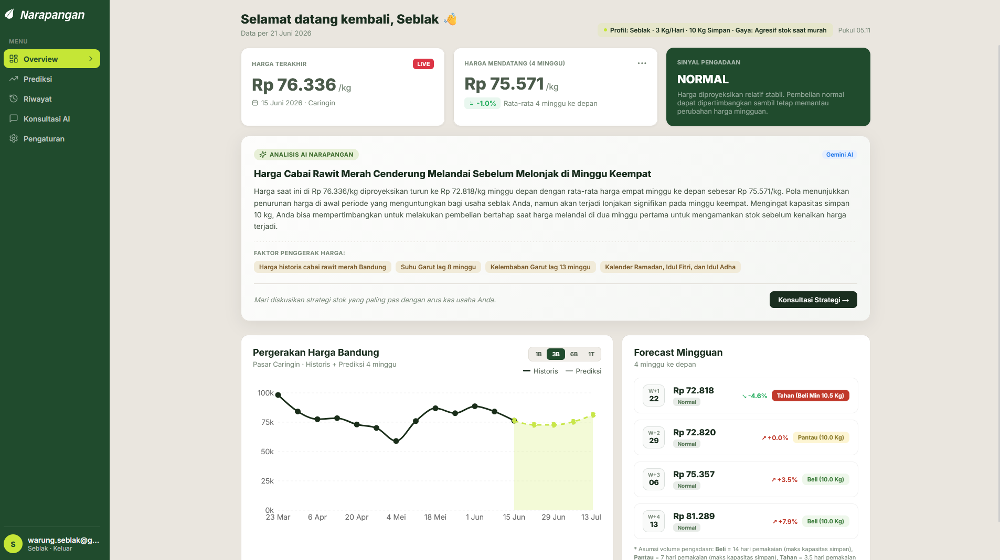
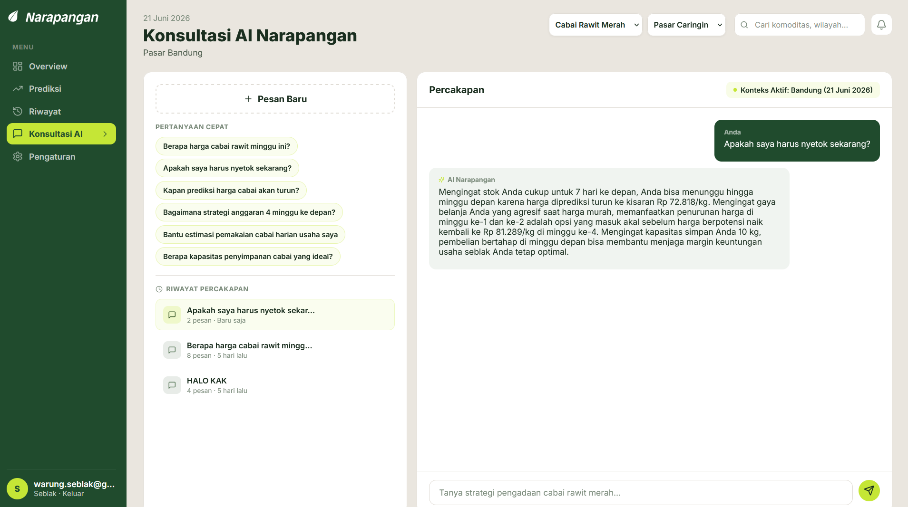
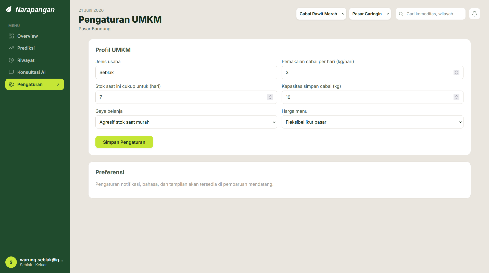

# Narapangan — AI-Powered Chilli Price Forecasting for UMKM

**Capstone Project** — Telkom University Bandung (2026)

[](https://python.org)
[](https://react.dev)
[](https://pytorch.org)
[](https://ai.google.dev)
[](LICENSE)

---



---

## Overview

Narapangan is a full-stack AI system that predicts **red cayenne pepper prices in Bandung** for the next 4 weeks — and explains those predictions in plain language, personalized to each UMKM's business profile.

**The problem:** Chilli prices in Indonesia can swing 20-40% within weeks due to weather, holidays, and supply-chain disruption. Small food businesses (UMKM) have no accessible tools to forecast prices or optimize procurement timing.

**Our approach:**
- **Automated data pipeline** — scrapes PIHPS (Bank Indonesia) prices and NASA POWER weather data for Garut (Bandung's main chilli producer)
- **ML/DL model comparison** — benchmarked 5 models: SARIMAX, Prophet, LSTM, NBEATSx, and NHITS
- **Exogenous features** — Garut weather lags + Hijri calendar events (Ramadan, Eid)
- **LLM integration** — Google Gemini translates forecasts into actionable, personalized advice
- **Interactive dashboard** — React SPA with simulation tools, AI chat, and admin monitoring

---

## System Architecture

```
 DATA INGESTION
  +-------------------+    +---------------------+    +---------------------+
  | PIHPS (BI)        |    | NASA POWER API      |    | Hijri Calendar      |
  | Playwright        |    | Garut weather       |    | Ramadan / Eid flags |
  | headless scrape   |    | (precip, temp,      |    |                     |
  | (4 commodities)   |    |  humidity)          |    |                     |
  +--------+----------+    +----------+----------+    +----------+----------+
           |                         |                           |
           +-------------------------+---------------------------+
                                     |
  +----------------------------------+----------------------------------+
  |                    FEATURE ENGINEERING                             |
  |  Weekly resampling (W-MON)  |  Lag features (8wk temp / 13wk hum) |
  |  Hijri merge               |  5 exogenous columns                  |
  +----------------------------------+----------------------------------+
                                     |
 MODEL INFERENCE
  +--------+   +--------+   +--------+   +--------+   +--------+
  | NBEATSx|   | NHITS  |   |SARIMAX |   | LSTM   |   | Prophet|
  | Rank 1 |   | Rank 2 |   | Rank 3 |   | Rank 4 |   | Rank 5 |
  | MAE    |   | DirAcc |   |        |   |        |   |        |
  | 3,030  |   | 93.3%  |   |        |   |        |   |        |
  +----+---+   +----+---+   +--------+   +--------+   +--------+
       |            |
       +-----+------+
             |
  +-----------------------------+
  | PROCUREMENT SIGNAL          |
  | stock_early / stable /      |
  | hold_purchase               |
  +-----------------------------+
             |
 BACKEND API (Python stdlib HTTP Server)
  +-----------------------------------------------------+
  | /api/predict  |  /api/chat  |  /api/auth/*          |
  | /api/admin/*  |  SQLite DB (9 tables)               |
  +---------------------------+-------------------------+
                              |
 LLM LAYER (Google Gemini 2.5 Flash)
  +-----------------------------------------------------+
  | Forecast explanation card (headline + body + offer) |
  | Full consultation chat (sessions, history, Q&A)     |
  | Personalized with business profile                  |
  | Rule-based fallback when API unavailable            |
  +---------------------------+-------------------------+
                              |
 FRONTEND (React 19 + Vite 8)
  +----------+  +----------+  +----------+  +----------+
  | Overview |  | Prediksi |  | Riwayat  |  | Konsultasi|
  | KPIs +   |  | Forecast |  | Accuracy |  | AI Chat   |
  | Chart +  |  | + Sim    |  | Audit    |  | + Sessions|
  | AI Card  |  | Playground|  |          |  |           |
  +----------+  +----------+  +----------+  +----------+
  +----------+  +----------+  +----------+
  |Pengaturan|  |Admin     |  |Admin     |
  | Profile  |  | Users    |  | System   |
  | Settings |  | Mgmt     |  | Monitor  |
  +----------+  +----------+  +----------+
```

---

## ML/DL Model Comparison

We benchmarked 5 models on 197 weeks of Bandung chilli price data (2022-2026) with 4-fold time-series cross-validation:

| Rank | Model | Type | MAE (Rp) | MAPE | Directional Acc. | Deployed |
|------|-------|------|-----------|------|------------------|----------|
| 1 | **NBEATSx** | Neural Network (NeuralForecast) | **3,030** | **6.33%** | 73.3% | **Primary** |
| 2 | **NHITS** | Neural Network (NeuralForecast) | 4,005 | 8.48% | **93.3%** | Backup |
| 3 | SARIMAX | Statistical (Seasonal ARIMA) | 5,428 | 14.03% | 40.0% | -- |
| 4 | LSTM | Deep Learning (PyTorch) | 9,029 | 19.17% | 73.3% | -- |
| 5 | Prophet | Bayesian Additive | 11,503 | 28.92% | 46.7% | -- |

**Key findings:**
- **NBEATSx** wins on absolute accuracy (MAE 3,030 Rp, ~6% error) — used as the primary model for all commodities
- **NHITS** has exceptional directional accuracy (93.3%) — deployed as ensemble backup for trend validation
- Hyperparameter tuning via Ray Tune actually *decreased* NBEATSx performance (the baseline was already optimal)
- Full training report: [`notebooks/LAPORAN_TRAINING_MODELLING.md`](notebooks/LAPORAN_TRAINING_MODELLING.md)

### Exogenous Features

| Feature | Source | Rationale |
|---------|--------|-----------|
| Garut_T2M_lag8w | NASA POWER (temperature, 8-week / 56-day lag) | Highest correlation from EDA |
| Garut_RH2M_lag13w | NASA POWER (humidity, 13-week / 91-day lag) | Highest correlation from EDA |
| is_ramadan | Hijri calendar | Demand spikes during Ramadan (month 9) |
| is_idul_fitri | Hijri calendar | Post-Ramadan consumption surge |
| is_idul_adha | Hijri calendar | Holiday demand pattern |

Lag periods were determined via EDA — we tested lags of 1, 3, 7, 30, 60, 90, and 120 days for both temperature and humidity against Bandung prices. The 60-day T2M and 90-day RH2M lags showed the strongest Pearson correlation coefficients, reflecting the biological delay between weather conditions in Garut (production city) and price impact at Bandung markets.

---

## Automated Pipeline

The system runs a fully automated daily pipeline:

| Stage | What | Technology |
|-------|------|-----------|
| 1. Scraping | Launches headless Chromium, navigates BI PIHPS site, extracts price grid for 4 commodities | Playwright |
| 2. Weather | Fetches daily precipitation, temperature, and humidity for Garut | NASA POWER REST API |
| 3. Feature Engineering | Resamples daily to weekly, computes lag features, merges Hijri flags | pandas |
| 4. Inference | Loads saved NBEATSx/NHITS/Prophet model, predicts 4 weeks ahead | NeuralForecast + PyTorch |
| 5. Signal | Generates procurement signal based on price change thresholds (+-5%) | Rule-based |
| 6. Cache | Saves payload to JSON (L1 cache) and SQLite (L2 cache) | |

A background scheduler runs hourly and auto-triggers if today's data is missing.

**Supported commodities and models:**

| Commodity | Production Model | Model Type |
|-----------|----------------|------------|
| Cabai Rawit Merah (red cayenne) | NBEATSx (primary) + NHITS (backup) | Neural Network |
| Bawang Merah (shallot) | NBEATSx | Neural Network |
| Bawang Putih (garlic) | NBEATSx | Neural Network |
| Telur Ayam Ras (chicken egg) | Prophet | Bayesian Additive |

---

## LLM Integration (Google Gemini)

The system integrates Gemini 2.5 Flash at two touchpoints:

### 1. AI Explanation Card
Every forecast response includes an LLM-generated explanation:
- **Headline** (~12 words) — summarizes the key price movement
- **Body** (~90 words, 3 sentences) — explains drivers (weather, season, holidays)
- **Offer** (1 sentence) — prompts the user to take action or consult further

All text is personalized using the UMKM's business profile:
> "Your business is a Warung Nasi using 2.0 kg/day with 3 days of stock — recommendation: buy 14 kg in weeks 1-2 when prices drop."

### 2. AI Consultation Chat
A full conversational interface with:
- Session history persistence (SQLite)
- Quick questions menu
- Out-of-scope guardrails (blocks non-food-supply questions)
- Markdown rendering in responses

Fallback chain: Gemini 2.5 Flash -> Gemini 2.0 Flash -> Rule-based -> Rate-limited message

---

## Frontend Pages

| Page | Features |
|------|----------|
| **Landing** | Hero section, public entry point |
| **Overview** | KPI cards (last price, avg forecast, signal), AI insight panel, interactive price chart (1m/3m/6m/1y views), 4-week forecast cards with action badges |
| **Prediksi** | Full forecast view with Simulation Playground — sliders for daily usage (0.5-20 kg) and storage (5-100 kg) that instantly update purchase recommendations |
| **Riwayat** | Accuracy audit table comparing past forecasts vs actual prices with MAE/MAPE/DA% KPIs |
| **Konsultasi** | Full-page AI chat with session management, quick questions, message history |
| **Pengaturan** | UMKM business profile form (business type, daily usage, stock days, storage capacity, buying style, price flexibility) |
| **Admin Users** | User management table with search, block, and soft-delete actions |
| **Admin System** | Pipeline monitor, health indicators, forecast accuracy charts, manual pipeline trigger |





---

## Tech Stack

| Layer | Technology |
|-------|-----------|
| Frontend | React 19, React Router 7, Recharts, Lucide React, Vite 8 |
| Backend | Python 3.12 stdlib (ThreadingHTTPServer — no Flask/FastAPI) |
| Machine Learning | NeuralForecast 3.1 (NBEATSx, NHITS), PyTorch 2, Prophet 1.3 |
| Data Pipeline | Playwright (headless Chromium), pandas, hijri-converter |
| LLM | Google Gemini 2.5 Flash (direct REST API, no SDK) |
| Database | SQLite (single-file, zero-config) |
| Auth | JWT (HMAC-SHA256) + PBKDF2 password hashing |
| Dev Script | PowerShell (`scripts/dev.ps1`) — launches both servers |

---

## Project Structure

```
narapangan/
  backend/
    api/                         HTTP server, auth, Gemini client
    pipeline/                    Scraping, feature engineering, inference
    narapangan_saved_model/      NBEATSx, NHITS, Prophet model checkpoints
    data_cache/                  JSON payload cache (L1)
    database.py                  SQLite schema and helpers
  frontend/
    src/
      pages/                     10 route pages
      components/                7 reusable components
      context/                   Global state (auth, profile, predictions)
      utils/                     Constants, helpers, formatters
  notebooks/                     Data ingestion, modeling, training report
  scripts/dev.ps1                One-command dev startup
  requirements.txt               Python dependencies
```

---

## Getting Started

### Prerequisites
- Windows 10/11
- Python 3.12
- Node.js 18+ and npm

### Quick Start

```powershell
# 1. Create and activate virtual environment
py -3.12 -m venv .venv
.\.venv\Scripts\Activate.ps1

# 2. Install dependencies
pip install -r requirements.txt
playwright install chromium
npm install --prefix frontend

# 3. (Optional) Add Gemini API key to .env file
# GEMINI_API_KEY=your_key_here

# 4. Run both backend and frontend
.\scripts\dev.ps1
```

### Access
- **Frontend:** http://localhost:5173
- **API:** http://localhost:8000
  - `POST /api/predict`
  - `GET /api/health`

### Default Accounts

| Role | Email | Password |
|------|-------|----------|
| Admin | admin@narapangan.com | admin123 |
| UMKM | umkm@narapangan.com | umkm123 |

---

## Academic Context

This project was developed as a **Capstone Project** at **Telkom University Bandung** (2026). The work included:

- Data science: scraping, cleaning, feature engineering, 5-model comparison
- Machine learning: time-series forecasting with exogenous variables
- Full-stack development: React frontend + Python API + SQLite
- LLM integration: Gemini for personalized business intelligence
- Academic output: proposal, modeling report, poster, and exhibition

---

## Team

- Faaris Khairrudin
- Farand Diy Dat Mahazalfaa
- Enuka Lula Ansori
- Eliezer Sharon Hutabarat

---

## License

MIT
